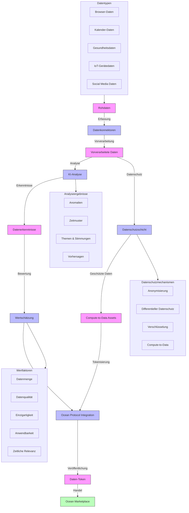

```mermaid
flowchart TD
    %% Hauptdatenfluss
    RawData[Rohdaten] --> |Erfassung| DataConnectors[Datenkonnektoren]
    DataConnectors --> |Vorverarbeitung| ProcessedData[Vorverarbeitete Daten]
    ProcessedData --> |Analyse| AIAnalysis[KI-Analyse]
    ProcessedData --> |Datenschutz| PrivacyLayer[Datenschutzschicht]
    AIAnalysis --> |Erkenntnisse| DataInsights[Datenerkenntnisse]
    PrivacyLayer --> |Geschützte Daten| C2DData[Compute-to-Data Assets]
    DataInsights --> |Bewertung| ValueEstimation[Wertschätzung]
    C2DData --> |Tokenisierung| OceanIntegration[Ocean Protocol Integration]
    ValueEstimation --> OceanIntegration
    OceanIntegration --> |Veröffentlichung| DataToken[Daten-Token]
    DataToken --> |Handel| Marketplace[Ocean Marketplace]
    
    %% Datentypen
    subgraph DataTypes[Datentypen]
        Browser[Browser-Daten]
        Calendar[Kalender-Daten]
        Health[Gesundheitsdaten]
        IoT[IoT-Gerätedaten]
        Social[Social Media Daten]
    end
    
    %% Analyseergebnisse
    subgraph AnalysisResults[Analyseergebnisse]
        Anomalies[Anomalien]
        Patterns[Zeitmuster]
        Topics[Themen & Stimmungen]
        Predictions[Vorhersagen]
    end
    
    %% Datenschutzmechanismen
    subgraph PrivacyMechanisms[Datenschutzmechanismen]
        Anonymization[Anonymisierung]
        DiffPrivacy[Differentieller Datenschutz]
        Encryption[Verschlüsselung]
        C2D[Compute-to-Data]
    end
    
    %% Wertfaktoren
    subgraph ValueFactors[Wertfaktoren]
        DataSize[Datenmenge]
        DataQuality[Datenqualität]
        Uniqueness[Einzigartigkeit]
        Applicability[Anwendbarkeit]
        TimeRelevance[Zeitliche Relevanz]
    end
    
    %% Verbindungen
    DataTypes --> RawData
    AIAnalysis --> AnalysisResults
    PrivacyLayer --> PrivacyMechanisms
    ValueEstimation --> ValueFactors
    
    %% Klassifizierung
    classDef data fill:#f9f,stroke:#333,stroke-width:1px
    classDef process fill:#bbf,stroke:#333,stroke-width:1px
    classDef result fill:#bfb,stroke:#333,stroke-width:1px
    classDef subgraphStyle fill:#ececff,stroke:#9370db,stroke-width:1px
    
    class RawData,ProcessedData,DataInsights,C2DData,DataToken data
    class DataConnectors,AIAnalysis,PrivacyLayer,ValueEstimation,OceanIntegration process
    class Marketplace result
    class DataTypes,AnalysisResults,PrivacyMechanisms,ValueFactors subgraphStyle
```
