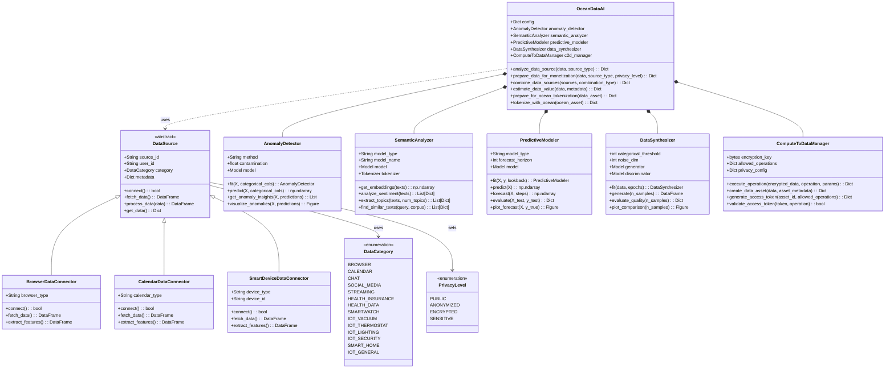

```mermaid
classDiagram
    %% Datenerfassungsmodule
    class DataSource {
        <<abstract>>
        +String source_id
        +String user_id
        +DataCategory category
        +Dict metadata
        +connect(): bool
        +fetch_data(): DataFrame
        +process_data(data): DataFrame
        +get_data(): Dict
    }
    
    class DataCategory {
        <<enumeration>>
        BROWSER
        CALENDAR
        CHAT
        SOCIAL_MEDIA
        STREAMING
        HEALTH_INSURANCE
        HEALTH_DATA
        SMARTWATCH
        IOT_VACUUM
        IOT_THERMOSTAT
        IOT_LIGHTING
        IOT_SECURITY
        SMART_HOME
        IOT_GENERAL
    }
    
    class PrivacyLevel {
        <<enumeration>>
        PUBLIC
        ANONYMIZED
        ENCRYPTED
        SENSITIVE
    }
    
    class BrowserDataConnector {
        +String browser_type
        +connect(): bool
        +fetch_data(): DataFrame
        +extract_features(): DataFrame
    }
    
    class CalendarDataConnector {
        +String calendar_type
        +connect(): bool
        +fetch_data(): DataFrame
        +extract_features(): DataFrame
    }
    
    class SmartDeviceDataConnector {
        +String device_type
        +String device_id
        +connect(): bool
        +fetch_data(): DataFrame
        +extract_features(): DataFrame
    }
    
    %% KI-Module
    class OceanDataAI {
        +Dict config
        +AnomalyDetector anomaly_detector
        +SemanticAnalyzer semantic_analyzer
        +PredictiveModeler predictive_modeler
        +DataSynthesizer data_synthesizer
        +ComputeToDataManager c2d_manager
        +analyze_data_source(data, source_type): Dict
        +prepare_data_for_monetization(data, source_type, privacy_level): Dict
        +combine_data_sources(sources, combination_type): Dict
        +estimate_data_value(data, metadata): Dict
        +prepare_for_ocean_tokenization(data_asset): Dict
        +tokenize_with_ocean(ocean_asset): Dict
    }
    
    class AnomalyDetector {
        +String method
        +float contamination
        +Model model
        +fit(X, categorical_cols): AnomalyDetector
        +predict(X, categorical_cols): np.ndarray
        +get_anomaly_insights(X, predictions): List
        +visualize_anomalies(X, predictions): Figure
    }
    
    class SemanticAnalyzer {
        +String model_type
        +String model_name
        +Model model
        +Tokenizer tokenizer
        +get_embeddings(texts): np.ndarray
        +analyze_sentiment(texts): List[Dict]
        +extract_topics(texts, num_topics): List[Dict]
        +find_similar_texts(query, corpus): List[Dict]
    }
    
    class PredictiveModeler {
        +String model_type
        +int forecast_horizon
        +Model model
        +fit(X, y, lookback): PredictiveModeler
        +predict(X): np.ndarray
        +forecast(X, steps): np.ndarray
        +evaluate(X_test, y_test): Dict
        +plot_forecast(X, y_true): Figure
    }
    
    class DataSynthesizer {
        +int categorical_threshold
        +int noise_dim
        +Model generator
        +Model discriminator
        +fit(data, epochs): DataSynthesizer
        +generate(n_samples): DataFrame
        +evaluate_quality(n_samples): Dict
        +plot_comparison(n_samples): Figure
    }
    
    %% Datenschutzmodule
    class ComputeToDataManager {
        +bytes encryption_key
        +Dict allowed_operations
        +Dict privacy_config
        +execute_operation(encrypted_data, operation, params): Dict
        +create_data_asset(data, asset_metadata): Dict
        +generate_access_token(asset_id, allowed_operations): Dict
        +validate_access_token(token, operation): bool
    }
    
    %% Beziehungen
    DataSource <|-- BrowserDataConnector
    DataSource <|-- CalendarDataConnector
    DataSource <|-- SmartDeviceDataConnector
    
    DataSource --> DataCategory : uses
    DataSource --> PrivacyLevel : sets
    
    OceanDataAI *-- AnomalyDetector
    OceanDataAI *-- SemanticAnalyzer
    OceanDataAI *-- PredictiveModeler
    OceanDataAI *-- DataSynthesizer
    OceanDataAI *-- ComputeToDataManager
    
    OceanDataAI ..> DataSource : uses
```
